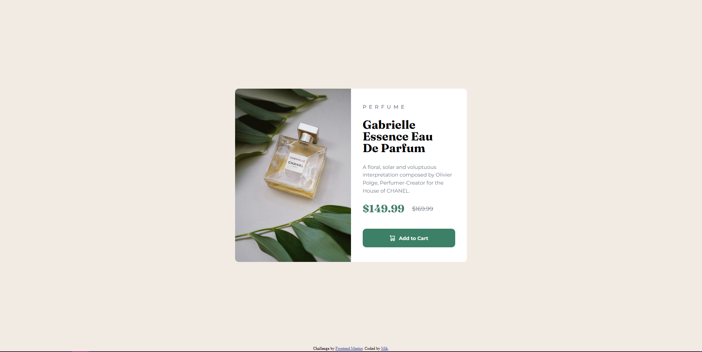

# Frontend Mentor - Product preview card component

## Welcome! 👋

Thanks for checking out this front-end coding challenge made by me, Mik. It was fun to do and a good challenge to test my growing skills.

I made it with only HTML5 and CSS with layout being made with Flexbox.

[Frontend Mentor](https://www.frontendmentor.io) challenges help you improve your coding skills by building realistic projects.

## Experience
While doing this project I flexed ;) my layout and responsive design. 

